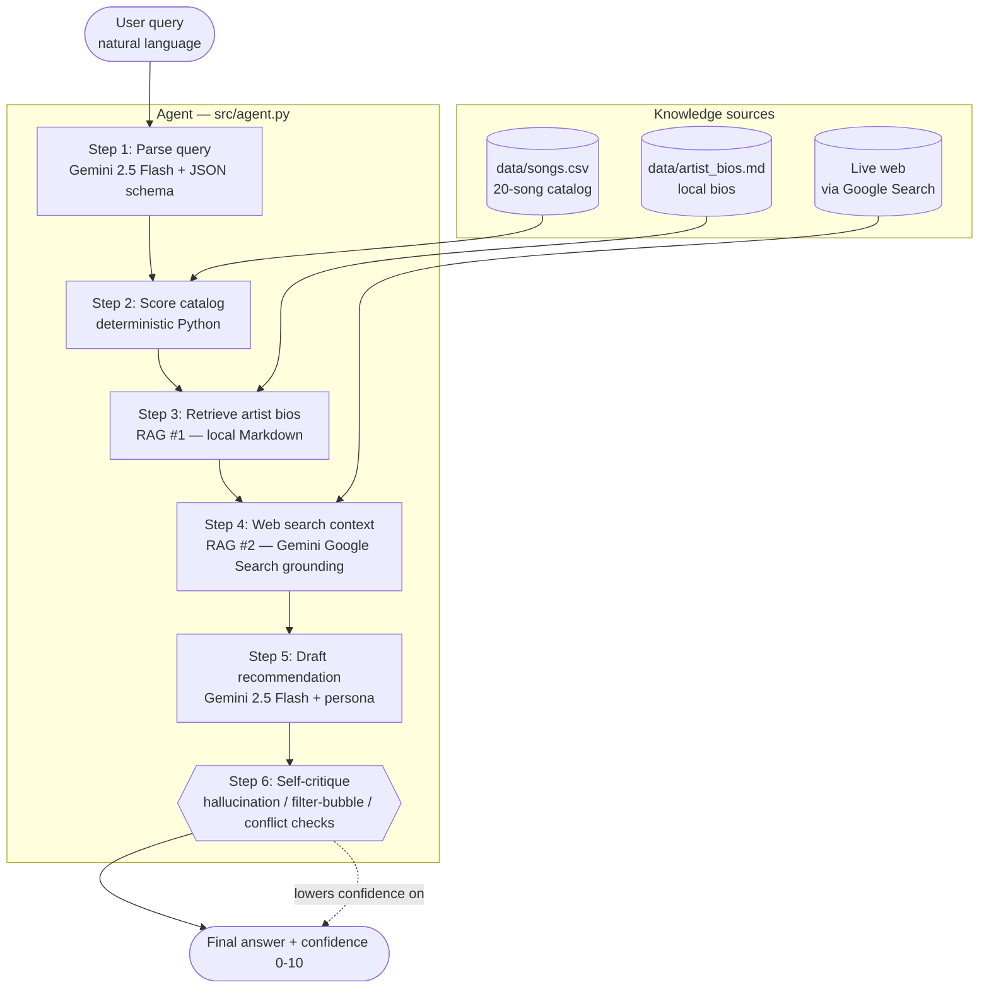
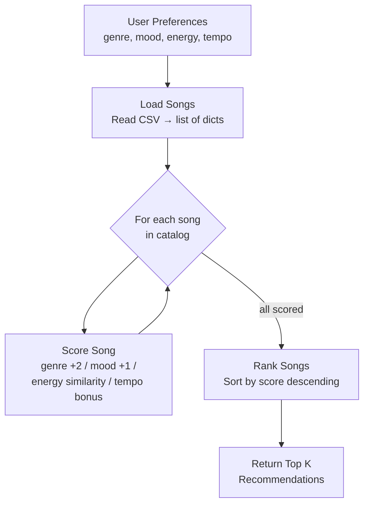

# MELODY 2.0 — Agentic RAG Music Recommender

MELODY wraps a deterministic content-based music scorer with a Gemini-powered
agent that **parses natural language, retrieves from two RAG sources, drafts
a recommendation, and critiques its own output** — streaming each reasoning
step to a Streamlit UI.

It started as a simple scoring exercise (VibeFinder 1.0); the original engine
is preserved unchanged in [src/recommender.py](src/recommender.py) and is
called as a tool from inside the agent loop.

---

## System Architecture



The orchestration is **fixed in code**, not LLM-decided. This is intentional:
the rubric requires a visible reasoning chain, and a deterministic step
sequence makes the chain predictable and inspectable. The intelligence lives
inside each step (parsing, drafting, critiquing) — the order is engineered.

---

## Quick Start

### 1. Install
```bash
pip install -r requirements.txt
```

### 2. Set your Gemini API key
Get a free key at https://aistudio.google.com/apikey, then:

```bash
cp .env.example .env
# edit .env and paste your key
```

### 3. Run something

| Command | Purpose |
|---|---|
| `streamlit run app.py` | **Interactive UI** — recommended. Watch the reasoning chain stream live. |
| `python src/agent.py "I want chill indie for studying"` | Terminal agent — same chain, plain text output. |
| `python evaluator.py` | Run the 5-input test harness; writes `eval_report.md`. |
| `python -m pytest tests/ -v` | Unit tests for the deterministic scorer (no API calls). |
| `python src/main.py` | Original VibeFinder 1.0 demo (no LLM, runs the four hardcoded profiles). |

---

## The Six Reasoning Steps

| # | Step | Tech | What it produces |
|---|------|------|------------------|
| 1 | **Parse query** | Gemini 2.5 Flash + JSON schema | A structured `UserProfile` plus interpretation notes |
| 2 | **Score catalog** | Pure Python (`recommend_songs`) | Top-k songs ranked by genre/mood/energy/tempo |
| 3 | **Retrieve artist bios** | File lookup against `data/artist_bios.md` | Local context for the top picks (RAG #1) |
| 4 | **Web search context** | Gemini Google Search grounding | Live web context with cited URLs (RAG #2) |
| 5 | **Draft recommendation** | Gemini 2.5 Flash + persona prompt | A user-facing draft using all the above |
| 6 | **Self-critique** | Gemini 2.5 Flash + JSON schema | Hallucination/filter-bubble/conflict flags + confidence 0-10 |

Each step yields a `StepEvent` (see [src/agent.py:64](src/agent.py#L64)) that
the UI consumes to render the chain in real time.

---

## Multi-Source RAG

| Source | Role | Where |
|---|---|---|
| `data/songs.csv` | Structured catalog (the "ground truth" the scorer ranks) | step 2 |
| `data/artist_bios.md` | Local Markdown — deterministic, in-universe context | step 3 |
| Google Search via Gemini grounding | Live web — real-world musical reference points | step 4 |

The local source keeps the agent's claims grounded in the simulation; the live
source adds outside context the agent cites with URLs in the UI.

---

## Persona / System Prompt

The agent runs under a strict librarian persona (see `PERSONA` in
[src/agent.py:31-50](src/agent.py#L31-L50)) with five rules it cannot break:

1. Only recommend songs from the catalog — no inventions.
2. Use bios verbatim where they help — no fabricated bios.
3. Every response ends with a self-critique.
4. Always emit a confidence score 0-10.
5. Be concise — the UI already shows the reasoning chain.

This is **measurably different** from a generic chatbot. Asked
"Recommend some Taylor Swift," the agent maps the request to a catalog
profile and explicitly notes Taylor Swift is not in the catalog, lowering
confidence to 4/10. A vanilla Gemini chat will happily invent her discography.

---

## Evaluation Harness

`evaluator.py` runs the agent against 5 golden inputs (3 standard, 2 edge
cases) and uses a **separate Gemini judge** (different prompt, low temperature)
to score each run against pre-declared pass/fail criteria.

**Latest run: 19/19 criteria passed (100%)** — see [eval_report.md](eval_report.md).

Edge cases:
- **`edge_case_conflict`** — "sad folk songs but with really high energy" — the
  agent correctly identifies the catalog cannot satisfy this and drops
  confidence to 3/10.
- **`edge_case_out_of_catalog`** — "recommend me Taylor Swift" — the agent
  notes Taylor Swift is not in the catalog and recommends adjacent pop, with
  confidence 4/10.

See [model_card.md §6](model_card.md#6-observed-failure-modes-honest) for honest
limitations the eval surfaced (filter bubbles, catalog gaps, judge bias).

---

## Project Structure

```
.
├── app.py                      Streamlit UI (live reasoning chain)
├── evaluator.py                Test harness — 5 goldens + Gemini judge
├── eval_report.md              Latest evaluation report (auto-generated)
├── data/
│   ├── songs.csv               20-song catalog (RAG ground truth)
│   └── artist_bios.md          Local bios (RAG source #1)
├── src/
│   ├── agent.py                Six-step reasoning chain
│   ├── recommender.py          Deterministic scorer (preserved from v1.0)
│   └── main.py                 Original CLI demo (no LLM)
├── tests/
│   └── test_recommender.py     Unit tests for the scorer (no API calls)
├── model_card.md               System documentation + honest limitations
├── reflection.md               Project reflection
├── requirements.txt
├── .env.example
└── .gitignore
```

---

## Rubric Checklist (Stretch Features)

- [x] **Agentic enhancement — reasoning chains** — 6 visible steps in
  terminal and Streamlit (`st.status` containers stream live)
- [x] **RAG enhancement — multi-source retrieval** — local Markdown +
  Gemini Google Search grounding (cited URLs in UI)
- [x] **Test harness** — `evaluator.py` runs 5 goldens; independent Gemini
  judge scores each against pre-declared criteria
- [x] **Fine-tuning / specialization** — strict 5-rule librarian persona,
  measurably different from a generic chatbot (refuses out-of-catalog)
- [x] **System architecture diagram** — Mermaid flowchart at the top of this
  README
- [x] **Honest model card** — [model_card.md §6](model_card.md#6-observed-failure-modes-honest)
  documents 6 real limitations observed during eval

---

## Original Scoring Engine (preserved from VibeFinder 1.0)

The deterministic scorer underlying step 2 is unchanged from the original
project. The rules:

| Feature        | Condition                        | Points   |
|----------------|----------------------------------|----------|
| Genre match    | song genre == user genre         | +2.0     |
| Mood match     | song mood == user mood           | +1.0     |
| Energy         | 1.0 − \|song_energy − target\|   | 0.0–1.0  |
| Tempo bonus    | within 15 BPM of target tempo    | +0.5     |

**Maximum possible score:** 4.5. Songs are scored independently, then ranked
descending; ties break alphabetically by title.

The original four hardcoded profiles (High-Energy Pop, Chill Lofi, Deep
Intense Rock, Sad Acoustic) are still demoable via `python src/main.py`.

### Original data flow (scoring engine only)


