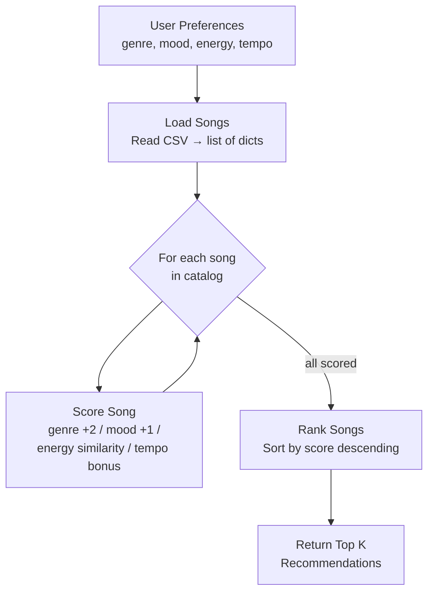

# Music Recommender Simulation

## How The System Works

### Real-World Recommendation Systems

Major streaming platforms like Spotify and TikTok use two primary strategies to predict what users will enjoy. **Collaborative filtering** looks at what similar users listen to — if User A and User B both love the same 50 songs, and User A just discovered a new track, the system assumes User B will probably like it too. **Content-based filtering** looks at the attributes of the music itself — genre, mood, tempo, energy, and acoustic features — and matches songs whose attributes are closest to what a user already enjoys.

Most production systems blend both approaches (a "hybrid" model), but this project focuses on **content-based filtering** because it's easier to reason about and doesn't require a large user base. Our version takes a user's taste profile (preferred genre, mood, and energy level) and scores every song in the catalog to find the best matches.

### Features Used

**Song object attributes** (from `data/songs.csv`):
- `genre` — categorical (pop, rock, electronic, indie, folk, r&b, country)
- `mood` — categorical (happy, chill, energetic, sad, intense)
- `energy` — numerical, 0.0–1.0 scale
- `tempo_bpm` — numerical, beats per minute

**UserProfile attributes:**
- `favorite_genre` — the genre the user prefers
- `favorite_mood` — the mood the user gravitates toward
- `target_energy` — the energy level the user enjoys (0.0–1.0)
- `target_tempo` — preferred tempo in BPM

### Algorithm Recipe (Scoring Logic)

Each song is scored against the user's profile using these rules:

| Feature        | Condition                        | Points   |
|----------------|----------------------------------|----------|
| Genre match    | song genre == user genre         | +2.0     |
| Mood match     | song mood == user mood           | +1.0     |
| Energy         | 1.0 − |song_energy − target|     | 0.0–1.0  |
| Tempo bonus    | within 15 BPM of target tempo    | +0.5     |

**Maximum possible score:** 4.5 points (genre + mood + perfect energy + tempo bonus).

After scoring every song, the system **ranks** them from highest to lowest and returns the top *k* results. This two-step process (score → rank) is standard in recommendation systems: the scoring rule evaluates one song at a time, while the ranking rule compares all songs to surface the best options.

### Potential Biases

This system will naturally **over-prioritize genre** because the genre match carries the heaviest weight (+2.0). A fantastic song with the perfect mood and energy but the "wrong" genre will always rank below a mediocre song in the right genre. This can create a **filter bubble** where users never discover music outside their stated preference. Additionally, the dataset is small (20 songs) and skewed — pop and indie have more entries than country or folk, meaning users who prefer underrepresented genres get fewer high-quality recommendations.

## Terminal Output

```
Loaded songs: 20

============================================================
  Profile: High-Energy Pop
  Genre=pop  Mood=happy  Energy=0.8  Tempo=120
============================================================

  #1  Sunshine Vibes  by DJ Sunny
       Score: 4.50
       Reasons: genre match 'pop' (+2.0), mood match 'happy' (+1.0), energy similarity (+1.00), tempo close to 120 BPM (+0.50)

  #2  Summer Festival  by Party Crew
       Score: 4.45
       Reasons: genre match 'pop' (+2.0), mood match 'happy' (+1.0), energy similarity (+0.95), tempo close to 120 BPM (+0.50)

  #3  Golden Hour  by Amber Light
       Score: 3.20
       Reasons: genre match 'pop' (+2.0), energy similarity (+0.70), tempo close to 120 BPM (+0.50)

  #4  Ocean Breeze  by Coastal Dreams
       Score: 2.65
       Reasons: genre match 'pop' (+2.0), energy similarity (+0.65)

  #5  Neon Nights  by Synth City
       Score: 2.45
       Reasons: mood match 'happy' (+1.0), energy similarity (+0.95), tempo close to 120 BPM (+0.50)


============================================================
  Profile: Chill Lofi
  Genre=indie  Mood=chill  Energy=0.3  Tempo=80
============================================================

  #1  Code & Coffee  by Lo-Fi Larry
       Score: 4.50
       Reasons: genre match 'indie' (+2.0), mood match 'chill' (+1.0), energy similarity (+1.00), tempo close to 80 BPM (+0.50)

  #2  Deep Focus  by Ambient Waves
       Score: 4.45
       Reasons: genre match 'indie' (+2.0), mood match 'chill' (+1.0), energy similarity (+0.95), tempo close to 80 BPM (+0.50)

  #3  Rainy Thoughts  by Mellow Mike
       Score: 3.50
       Reasons: genre match 'indie' (+2.0), energy similarity (+1.00), tempo close to 80 BPM (+0.50)

  #4  Lullaby Lane  by Soft Tones
       Score: 3.40
       Reasons: genre match 'indie' (+2.0), energy similarity (+0.90), tempo close to 80 BPM (+0.50)

  #5  Velvet Dreams  by Jazz Cat
       Score: 2.45
       Reasons: mood match 'chill' (+1.0), energy similarity (+0.95), tempo close to 80 BPM (+0.50)


============================================================
  Profile: Deep Intense Rock
  Genre=rock  Mood=intense  Energy=0.9  Tempo=145
============================================================

  #1  Fire Starter  by Blaze Band
       Score: 4.50
       Reasons: genre match 'rock' (+2.0), mood match 'intense' (+1.0), energy similarity (+1.00), tempo close to 145 BPM (+0.50)

  #2  Dark Alley  by The Shadows
       Score: 4.45
       Reasons: genre match 'rock' (+2.0), mood match 'intense' (+1.0), energy similarity (+0.95), tempo close to 145 BPM (+0.50)

  #3  Thunderstorm  by Heavy Hitters
       Score: 4.45
       Reasons: genre match 'rock' (+2.0), mood match 'intense' (+1.0), energy similarity (+0.95), tempo close to 145 BPM (+0.50)

  #4  Electric Pulse  by Beat Master
       Score: 1.50
       Reasons: energy similarity (+1.00), tempo close to 145 BPM (+0.50)

  #5  Bass Drop City  by DJ Thunder
       Score: 1.45
       Reasons: energy similarity (+0.95), tempo close to 145 BPM (+0.50)


============================================================
  Profile: Sad Acoustic (Edge Case)
  Genre=folk  Mood=sad  Energy=0.9  Tempo=150
============================================================

  #1  Campfire Song  by Folk Friends
       Score: 2.65
       Reasons: genre match 'folk' (+2.0), energy similarity (+0.65)

  #2  Acoustic Morning  by Sarah Strings
       Score: 2.60
       Reasons: genre match 'folk' (+2.0), energy similarity (+0.60)

  #3  Electric Pulse  by Beat Master
       Score: 1.50
       Reasons: energy similarity (+1.00), tempo close to 150 BPM (+0.50)

  #4  Fire Starter  by Blaze Band
       Score: 1.50
       Reasons: energy similarity (+1.00), tempo close to 150 BPM (+0.50)

  #5  Lonely Highway  by Desert Wind
       Score: 1.50
       Reasons: mood match 'sad' (+1.0), energy similarity (+0.50)
```

## Data Flow Diagram


